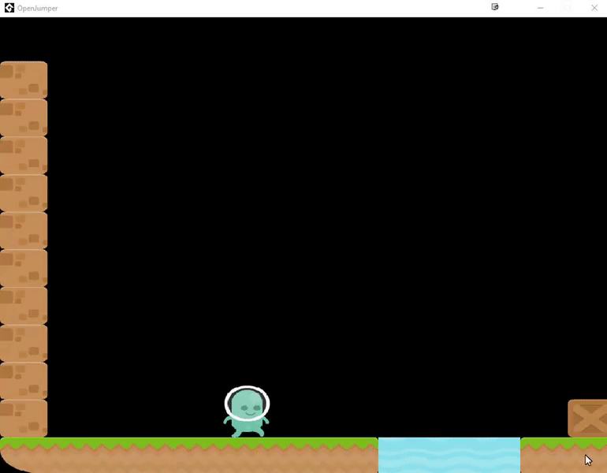

### OpenJumper

Open Source Platform Game using Game Maker Studio 2

### Changelog
v1.0.2 
- Added better code for controls and collisions
- Added double jumping
- Added walking/jumping/falling left animations

v1.0.1 
- Changed Tileset to Kenny's Platformer (http://kenney.nl)
- Added New Music for testlevel (http://kenney.nl)
- Added better jumping sound (http://kenney.nl)
- Moved player controls to script (Making better)
- Added oGame object to control music and exit game

v1.0.0 
- Inital files
- Added Basic Player Animations 

